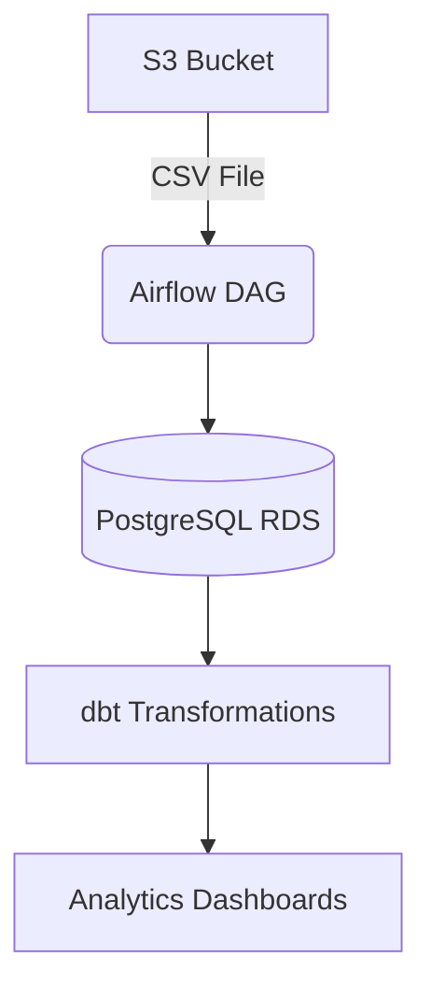

# AWS MWAA ELT Pipeline with dbt  
This project was developed as part of an **assessment** for [DigitalXC AI](https://digitalxc.com/) and this is an **extension of** the original project: [Airflow_DBT_Superset_Project](https://github.com/priyanshubiswas-tech/Airflow_DBT_Superset_Project.git).  
The **dataset used remains the same**, but this repository builds upon and enhances the original pipeline with additional features, improvements, or alternate implementations.

**Automated Data Pipeline for Ticket Analytics**  
*Extract ticket data from S3 → Load to PostgreSQL → Transform with dbt → Schedule with Airflow*  


---

##  Key Features  
- **End-to-End Automation** - From raw CSV to analytics-ready tables  
- **Modern Data Stack** - Airflow + dbt + PostgreSQL on AWS  
- **Production-Ready** - Error handling, retries, and validation  
- **Scalable Architecture** - Built on AWS MWAA (Managed Workflows for Apache Airflow)  

---

##  Architecture  


---

##  Project Structure  


```bash
s3://priyanshu-airflow-dag-bucket/
├── dags/                          # Airflow DAGs
│   ├── requirements.txt           # Python dependencies
│   ├── etl_pipeline.py            # Main DAG file
│   └── dbt/
│       └── demo/                  # dbt project
│           ├── dbt_project.yml    # dbt config
│           ├── profiles.yml       # DB credentials
│           ├── schema.yml         # Documentation
│           └── models/
│               ├── clean_incidents.sql
│               ├── avg_resolution_time.sql
│               └── ...
└── ticket_dump.csv                # Source data
```
> **Note:** The AWS resources (Airflow environment, S3 bucket, etc.) used in the original project have been deleted as the tasks were time-bound and are now completed.  
> This repository does not follow the exact same file structure as the original. Some files such as `schema.yml` and certain DBT models are not included.  
> Since this is an extension of the [Airflow_DBT_Superset_Project](https://github.com/priyanshubiswas-tech/Airflow_DBT_Superset_Project.git), you can refer to that repository to access the original models and configurations.  
> Please make sure to manage your own endpoint details and AWS-specific dependencies accordingly.

---
##  Apache Superset

<div align="center">
  
</div>

##  How It Works  

### 1. Extract: Get Data from S3  
```python
def download_from_s3():
    s3_hook = S3Hook(aws_conn_id='aws_default')
    file_obj = s3_hook.get_key(bucket_name="priyanshu-airflow-dag-bucket", key="ticket_dump.csv")
    file_obj.download_fileobj('/tmp/data.csv')
```
- Uses Airflow's `S3Hook` to fetch CSV  
- Saves to local `/tmp/` for processing  

### 2. Load: Import to PostgreSQL  
```python
def load_to_postgres():
    pg_hook = PostgresHook(postgres_conn_id='postgres_rds')
    with open('/tmp/data.csv', 'r') as f:
        pg_hook.copy_expert("COPY tickets FROM STDIN WITH CSV", f)
```
- Bulk loads data using PostgreSQL's `COPY` command  
- Handles large datasets efficiently  

### 3. Transform: dbt transformations  
```bash
# Runs these dbt models:
models/
├── clean_incidents.sql          # Standardize data
├── avg_resolution_time.sql      # KPI calculation
└── monthly_summary.sql          # Aggregations
```
- Cleans raw data  
- Calculates business metrics  
- Creates analytics-ready tables  

### 4. Orchestrate: Airflow DAG  
```python
with DAG(dag_id='aws_mwaa_etl_pipeline_production', schedule_interval='@daily') as dag:
    extract = PythonOperator(task_id='extract', python_callable=download_from_s3)
    load = PythonOperator(task_id='load', python_callable=load_to_postgres)
    transform = BashOperator(task_id='transform', bash_command="dbt run")
    
    extract >> load >> transform
```
- Runs daily at midnight  
- Automatic retries on failure  
- Full dependency management  

---

##  Deployment  

### AWS MWAA Setup  
1. Upload to S3:  
   ```bash
   aws s3 sync . s3://priyanshu-airflow-dag-bucket/dags/
   ```
2. `requirements.txt` structure:  
   ```text
   dbt-core==1.5.0
   dbt-postgres==1.5.0
   apache-airflow-providers-amazon==8.7.0
   ``` 

---

##  Why This Matters  

### Business Impact  
- **Data-Driven Decisions** - Clean, reliable metrics for ticket management  
- **Time Savings** - Eliminates manual CSV processing  
- **Data Quality** - dbt tests catch anomalies  

### Technical Value  
- **Pythonic** - Clean, maintainable code  
- **Modular** - Easy to add new data sources  
- **Cloud-Native** - Fully managed AWS services  

---

##  Troubleshooting  

| Error | Solution |
|-------|----------|
| `No module named dbt` | Check `requirements.txt` is in `/dags/` |
| `S3 file not found` | Verify CSV is in bucket root (not `/dags/`) |
| `PostgreSQL connection failed` | Check `profiles.yml` credentials |

---


